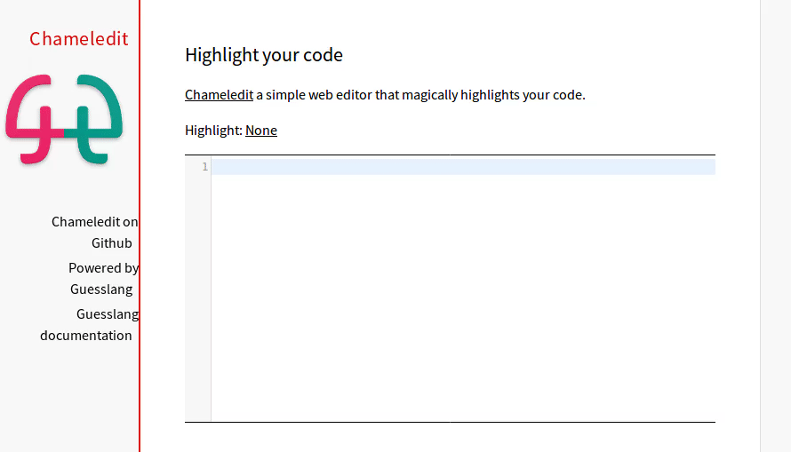

# Guesslang [](https://travis-ci.org/yoeo/guesslang) [](http://guesslang.readthedocs.io/en/latest/?badge=latest)


Guesslang detects the programming language of a given source code:

```bash
echo '
package main
import "fmt"

func main() {
    fmt.Println("My mascot is a gopher and Google loves me. Who am I?")
}

' | guesslang

# ⟶ Programming language: Go
```

Guesslang supports `30 programming languages`:

| Languages      |               |                    |        |              |
|----------------|---------------|--------------------|--------|--------------|
| `Batchfile`    | `C`           | `C#`               | `C++`  | `CSS`        |
| `CoffeeScript` | `Erlang`      | `Go`               | `HTML` | `Haskell`    |
| `Java`         | `JavaScript`  | `Jupyter Notebook` | `Lua`  | `Markdown`   |
| `Matlab`       | `Objective-C` | `PHP`              | `Perl` | `PowerShell` |
| `Python`       | `R`           | `Ruby`             | `Rust` | `SQL`        |
| `Scala`        | `Shell`       | `Swift`            | `TeX`  | `TypeScript` |

With a guessing **accuracy higher than 90%**.

## Apps powered by Guesslang

#### Chameledit

[Chameledit](https://github.com/yoeo/chameledit) is a simple web-editor
that automatically highlights your code.



##### Pasta

[Pasta](https://github.com/yoeo/pasta) is a [Slack](https://slack.com) bot
that pretty pastes source code.

[Watch the demo here](https://github.com/yoeo/pasta)

#### GG

[GG](https://github.com/yoeo/gg) is a silly guessing game.

## Documentation

* Guesslang documentation is available at
  https://guesslang.readthedocs.io/en/latest/

* Guesslang language detection explained here
  https://guesslang.readthedocs.io/en/latest/how.html

* Guesslang is based on [Tensorflow](https://github.com/tensorflow/tensorflow)
  machine learning framework

## Installation

* Python 3.6+ is required

* Install the latest stable version:

```bash
pip3 install guesslang
```

* or install Guesslang from source code:

```bash
pip3 install .
```

* Windows specific

To run [Tensorflow](https://github.com/tensorflow/tensorflow)
on Microsoft Windows you need to install Visual C++ runtime libraries,
available on [Microsoft website](https://www.microsoft.com/en-us/download/details.aspx?id=53587)

## Guesslang command line

* Show all available options

```bash
guesslang --help
```

* Detect the programming language of ``/bin/which``:

```bash
guesslang /bin/which

# ⟶ Programming language: Shell
```

* Detect the programming language of a given text:

```bash
echo '
/** Turn command line arguments to uppercase */
object Main {
  def main(args: Array[String]) {
    val res = for (a <- args) yield a.toUpperCase
    println("Arguments: " + res.toString)
  }
}
' | guesslang

# ⟶ Programming language: Scala
```

* Show the detection probabilities for a given source code:

```bash
echo "
def qsort(items):
    if not items:
        return []
    else:
        pivot = items[0]
        less = [x for x in items if x <  pivot]
        more = [x for x in items[1:] if x >= pivot]
        return qsort(less) + [pivot] + qsort(more)


if __name__ == '__main__':
    items = [1, 4, 2, 7, 9, 3]
    print(f'Sorted: {qsort(items)}')

" | guesslang --probabilities

# Language name       Probability
#  Python               80.53%
#  Batchfile             6.16%
#  CoffeeScript          2.18%
#  Markdown              1.66%
#  JavaScript            1.47%
# ...
```

## Guesslang Python package

* Guesslang can be used as a Python package.
  [Package documentation available here](https://guesslang.readthedocs.io/en/latest/guesslang.html)

``` python

from guesslang import Guess


guess = Guess()

name = guess.language_name("""
    % Quick sort

    -module (recursion).
    -export ([qsort/1]).

    qsort([]) -> [];
    qsort([Pivot|T]) ->
          qsort([X || X <- T, X < Pivot])
          ++ [Pivot] ++
          qsort([X || X <- T, X >= Pivot]).
""")

print(name)  # ⟶ Erlang
```

## License and credits

* [Guesslang documentation](https://guesslang.readthedocs.io/en/latest/)

* Gesslang training dataset created with
  [GuesslangTools](https://github.com/yoeo/guesslangtools)

* Guesslang developped with [Tensorflow](https://www.tensorflow.org/)

* Guesslang icon created with
  [AndroidAssetStudio](https://github.com/romannurik/AndroidAssetStudio)
  and
  [Eduardo Tunni's Warnes font](https://fonts.google.com/specimen/Warnes)

* Example source codes used here retrieved from
  [Rosetta Code](https://rosettacode.org/wiki/Sorting_algorithms/Quicksort)

* Guesslang — Copyright (c) 2020 Y. SOMDA, [MIT License](LICENSE)
