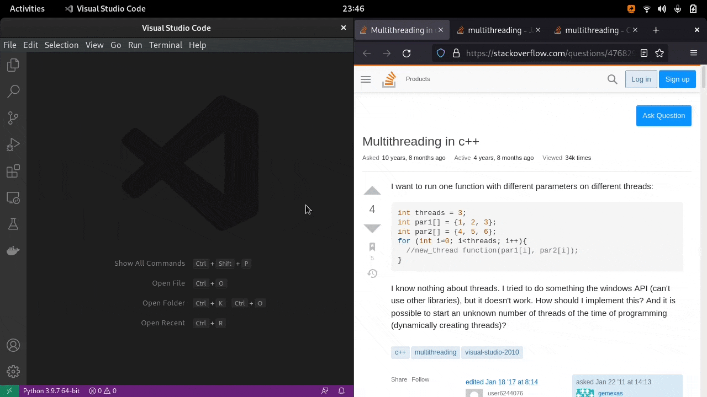
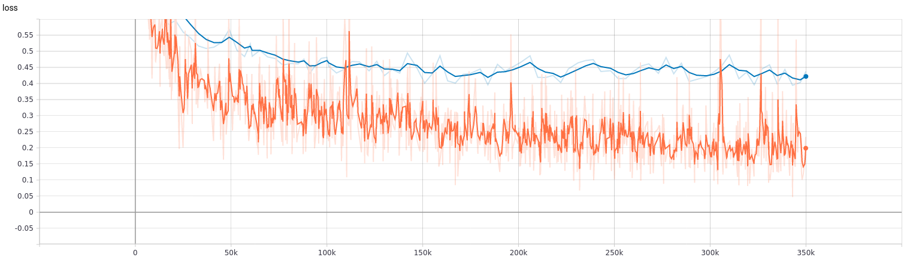
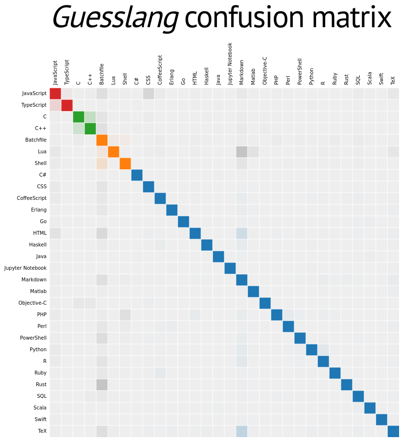

Guesslang documentation
=======================

.. image:: https://img.shields.io/badge/github-source%20code-blue?logo=github&logoColor=white
  :alt: View on Github
  :target: https://github.com/yoeo/guesslang/
.. image:: https://img.shields.io/pypi/v/guesslang.svg
  :target: https://pypi.python.org/pypi/guesslang
  :alt: Pypi Version
.. image:: https://img.shields.io/pypi/l/guesslang.svg
  :target: https://pypi.python.org/pypi/guesslang/
  :alt: License

Guesslang detects the programming language of a given source code.
It supports more than **50** programming **languages** and detects
the correct programming language with more than **90% accuracy**.

`Guesslang is an open source <https://github.com/yoeo/guesslang>`_
deep learning software that have been trained with
**over a million** source code files.

You can use Guesslang as a command line interface tool or as a Python module:

.. code-block:: python

  from guesslang import Guess

  guess = Guess()

  # Guess the language from code
  language = guess.language_name("""
      % Quick sort

      -module (recursion).
      -export ([qsort/1]).

      qsort([]) -> [];
      qsort([Pivot|T]) ->
             qsort([X || X <- T, X < Pivot])
             ++ [Pivot] ++
             qsort([X || X <- T, X >= Pivot]).
      """)

  print(language)  # --> Erlang

Guesslang supports **54** of the **world's most popular** programming languages:

+-----------+---------------+--------------+---------------+-------------+
|  Assembly |  Batchfile    |  C           |  C#           |  C++        |
+-----------+---------------+--------------+---------------+-------------+
|  Clojure  |  CMake        |  COBOL       |  CoffeeScript |  CSS        |
+-----------+---------------+--------------+---------------+-------------+
|  CSV      |  Dart         |  DM          |  Dockerfile   |  Elixir     |
+-----------+---------------+--------------+---------------+-------------+
|  Erlang   |  Fortran      |  Go          |  Groovy       |  Haskell    |
+-----------+---------------+--------------+---------------+-------------+
|  HTML     |  INI          |  Java        |  JavaScript   |  JSON       |
+-----------+---------------+--------------+---------------+-------------+
|  Julia    |  Kotlin       |  Lisp        |  Lua          |  Makefile   |
+-----------+---------------+--------------+---------------+-------------+
|  Markdown |  Matlab       |  Objective-C |  OCaml        |  Pascal     |
+-----------+---------------+--------------+---------------+-------------+
|  Perl     |  PHP          |  PowerShell  |  Prolog       |  Python     |
+-----------+---------------+--------------+---------------+-------------+
|  R        |  Ruby         |  Rust        |  Scala        |  Shell      |
+-----------+---------------+--------------+---------------+-------------+
|  SQL      |  Swift        |  TeX         |  TOML         |  TypeScript |
+-----------+---------------+--------------+---------------+-------------+
|  Verilog  |  Visual Basic |  XML         |  YAML         |             |
+-----------+---------------+--------------+---------------+-------------+

.. _end-description:

Guesslang is used by
`Visual Studio Code <https://code.visualstudio.com/>`_ to
`automatically detect the programming language <https://code.visualstudio.com/updates/v1_60#_automatic-language-detection>`_
of the source code that you paste into the editor:

  Visual Studio Code automatic language detection.

Guesslang is used by other projects including:

* `Chameledit <https://github.com/yoeo/chameledit>`_ a web-editor
  that auto-highlights code,

* `Pasta <https://github.com/yoeo/pasta>`_ a `Slack <https://slack.com>`_ bot
  that pretty-pastes code,

* `GG <https://github.com/yoeo/gg>`_ a guessing game.

Install Guesslang
=================

Guesslang requires **Python 3.7 or later**.

Install from Pypi
-----------------

You can run the following command to install Guesslang on your system:

.. code-block:: shell

  pip install guesslang

Install from source code
------------------------

To install Guesslang from source code,
just download the source code from https://github.com/yoeo/guesslang,
then run this command:

.. code-block:: shell

  pip install .

Usage
=====

Python package
--------------

Guesslang Python library helps you detect the programming language
of a given text within your Python program.
The Python classes are fully documentation here: :doc:`guesslang`.

Command line tool
-----------------

On a terminal emulator, you can detect the programming language
of a source code file by running ``guesslang /path/to/file``.

As well, you can detect the programming language of a source code
provided through the standard input using a
`pipeline <https://en.wikipedia.org/wiki/Pipeline_%28Unix%29>`_
like ``some-command | guesslang``.

Examples:

* Detect the programming language of ``/etc/bashrc`` configuration file

  .. code-block:: shell

    guesslang /etc/bashrc

    # ⟶ Programming language: Shell

* Detect the programming language of a source code stored in a file

  .. code-block:: shell

    echo "
      class Array
        def quick_sort
          return self if length <= 1
          pivot = self[0]
          less, greatereq = self[1..-1].partition { |x| x < pivot }
          less.quick_sort + [pivot] + greatereq.quick_sort
        end
      end
    " > /tmp/quicksort

    guesslang /tmp/quicksort

    # ⟶ Programming language: Ruby

* Execute a command that generates source code then detect
  the programming language on the fly:

  .. code-block:: shell

    echo '
      Array.prototype.quick_sort = function () {
         if (this.length < 2) { return this; }

         var pivot = this[Math.round(this.length / 2)];

         return this.filter(x => x <  pivot)
                    .quick_sort()
                    .concat(this.filter(x => x == pivot))
                    .concat(this.filter(x => x >  pivot).quick_sort());
      };
    ' | guesslang

    # ⟶ Programming language: JavaScript

* Show the programming language detection confidence score as probabilities:

  .. code-block:: shell

    echo "
    def qsort(items):
        if not items:
            return []
        else:
            pivot = items[0]
            less = [x for x in items if x <  pivot]
            more = [x for x in items[1:] if x >= pivot]
            return qsort(less) + [pivot] + qsort(more)

    if __name__ == '__main__':
        items = [1, 4, 2, 7, 9, 3]
        print(f'Sorted: {qsort(items)}')

    " | guesslang --probabilities

    # Language name       Probability
    #  Python               74.80%
    #  Haskell               6.73%
    #  CoffeeScript          5.32%
    #  Groovy                1.95%
    #  Markdown              0.93%
    #  ...

With Guesslang command line tool you can also
show the detection **probabilities** for a given source code
and even **train** your **custom** programming language detection model.

Run ``guesslang --help`` to see all the available options.

How does Guesslang guess?
=========================

Deep learning Model
-------------------

Guesslang uses a deep learning `Tensorflow <https://www.tensorflow.org/>`_
model built with **1,900,000** unique source code files,
randomly picked from **170,000** public Github projects.

Guesslang model is a Deep Neural Network classifier
combined with Linear classifier.
The model's hyperparameters have been fine tuned to have both
the best **performances** and the best **generalization**.

Training
--------

Having a data set with a **very large** number of **diverse** examples
is essential to correctly train a model.
This large dataset is built with
`GuesslangTools <https://github.com/yoeo/guesslangtools>`_.
It is used to train, evaluate and test Guesslang's deep learning model.

To avoid `overfitting <https://en.wikipedia.org/wiki/Overfitting>`_,
each repositories is **strictly** associated with only one of
the 3 aforementioned tasks.
Therefore files from a repository assigned to the training task
can only be used to train the model and cannot be used to evaluate nor test it.

The training and evaluation steps are done in a loop, as shown by the following
`loss curve <https://en.wikipedia.org/wiki/Loss_function>`_.

   *— Loss curve, less is better.*

   🟧 *training,* 🟦 *evaluation.*

The test in the other hand is done after the last training and evaluation steps
to ensure that the final model performs well.

Accuracy
--------

Guesslang deep learning model performs very well, with **93.45% accuracy**.
This accuracy was calculated by testing Guesslang
with 230,000 distinct source files.

Limitations
-----------

Guesslang accuracy is very high but it is not perfect.

Some challenging source codes that are at the border between two languages
can fool Guesslang.
In fact, a valid C source code is
`almost always <https://en.wikipedia.org/wiki/Compatibility_of_C_and_C%2B%2B#Constructs_valid_in_C_but_not_in_C++>`_
a valid C++ code,
and a valid JavaScript source code
`is always <http://channel9.msdn.com/posts/Anders-Hejlsberg-Introducing-TypeScript>`_
a valid TypeScript code.

This phenomenon is shown by Guesslang's
`confusion matrix <https://en.wikipedia.org/wiki/Confusion_matrix>`_:

  — Lines: actual languages. Columns: guessed languages.

.. raw:: html

  

    🟪 JavaScript/TypeScript confusion.
    🟥 Java/Groovy confusion.
    🟩 C/C++ confusion.
    🟧 Shell/Batchfile confusion.
    🟦 Languages with low to no confusion.
  

   
   

In addition to that, Guesslang may not guess the correct
programming languages of **very small** code snippets.
Small snippets don't always provide enough insights to accurately
guess the programming language.

For example, ``print("Hello world")`` is a valid code snippet in several
programming languages including Python, Scala, Ruby, Lua, Perl, etc...

References
==========

* `Guesslang source code is on Github <https://github.com/yoeo/guesslang>`_.
* Guesslang is developed with `Tensorflow <https://www.tensorflow.org/>`_
  machine learning framework.
* Use `GuesslangTools <https://github.com/yoeo/guesslangtools>`_
  to build your own training dataset.
* The example codes used in this documentation come from
  `Rosetta Code <https://rosettacode.org/wiki/Sorting_algorithms/Quicksort>`_.
* Guesslang logo has been created with
  `Android Asset Studio <https://github.com/romannurik/AndroidAssetStudio>`_
  and `Eduardo Tunni's Warnes font <https://fonts.google.com/specimen/Warnes>`_.
* Guesslang — Copyright (c) 2021 Y. SOMDA,
  `MIT Licence <https://github.com/yoeo/guesslang/blob/master/LICENSE>`_.

* :ref:`genindex`
* :ref:`modindex`
* :ref:`search`
