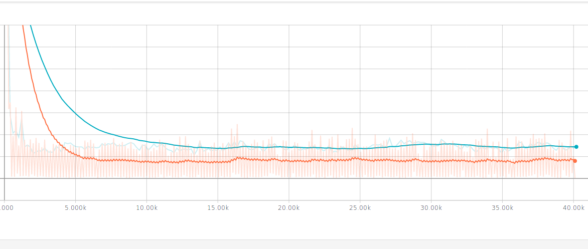
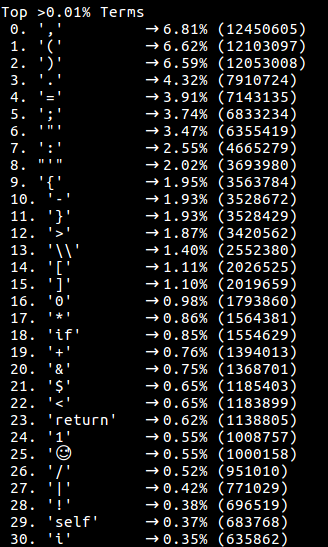
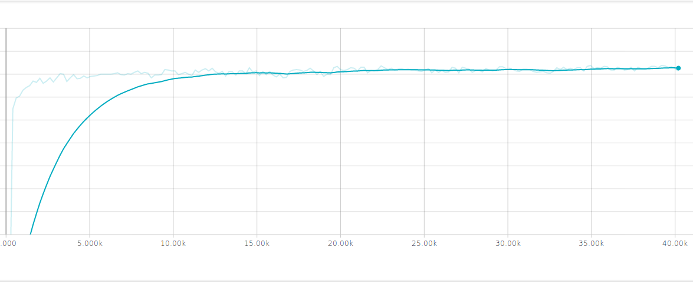
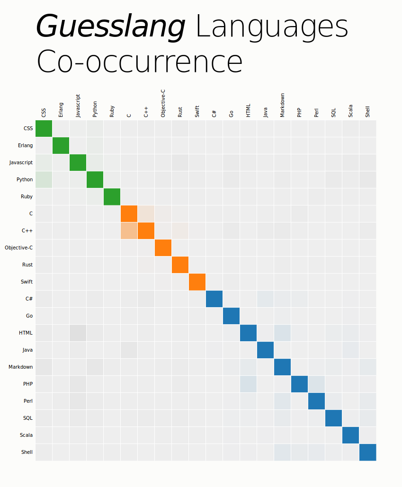

How does Guesslang guess?
=========================

.. toctree::
   :maxdepth: 2

Guesslang is a machine learning application.
It means that Guesslang ``learns itself`` how to classify source code
by reading examples.

Source Code Processing
----------------------

The source code that is given to Guesslang is transformed
into features vector and used to fit a
`Tensorflow <https://www.tensorflow.org/>`_ machine learning classifier.

The features vector is computed using
the `Bag Of Words method <https://en.wikipedia.org/wiki/Bag-of-words_model>`_
along with the `Hashing Trick <https://en.wikipedia.org/wiki/Feature_hashing>`_

For example,

* when you give the following source code to Guesslang:

.. code-block:: python
    :linenos:

    for my_counter in range(1337):
        print(my_counter)

* the source code is split into tokens:

.. code-block:: python
    :linenos:

    [
        'for',
        'my_counter',
        'in',
        'range',
        '(',
        '1337',
        ')',
        ':',
        '\n',
        'print',
        '(',
        'my_counter',
        ')'
    ]

* the big numbers and the non-common words are replaced by special tokens:

.. code-block:: python
    :linenos:

    [
        'for',
        '<variable>',
        'in',
        'range',
        '(',
        '<number>',
        ')',
        ':',
        '\n',
        'print',
        '(',
        '<variable>',
        ')'
    ]

* the tokens are then hashed (SHA1) and put into a counter vector:

.. code-block:: python
    :linenos:

    [
      0,  # <-- no token hash match this position
      ...,
      1,  # <-- token 'range' hash matches this position, 1 occurrence
      0,
      ...,
      2,  # <-- token '<variable>' hash matches this position, 2 occurrences
      0,
      ...,
      1,  # <-- token 'for' hash matches this position, 1 occurrence
      0,
      ... # and so on...
    ]

* bigrams and trigrams are also computed and their occurrences
  are added to the vector:

.. code-block:: python
    :linenos:

    bigrams = [
      'for <variable>',
      '<variable> in',
      'in range',
      'range (',
      ...
    ]

    trigrams = [
      'for <variable> in',
      '<variable> in range',
      'in range (',
      ...
    ]

* the result vector is finally normalized into a vector of length 1
  and used to fit Guesslang classifier.

Machine Learning Classifier
---------------------------

Guesslang uses a machine learning classifier that mixes:

* a **Linear Classifier**

* and a **3 layers Deep Neural Network Classifier**

`More details here... <https://www.tensorflow.org/api_docs/python/tf/contrib/learn/DNNLinearCombinedClassifier>`_

This classifier gives the **best accuracy**
and the **best stability against overfit**
among `Tensorflow Contrib' Classifiers <https://www.tensorflow.org/api_docs/python/tf/contrib/learn>`_.

  -- Classifier performances during training (lower is better)

Training data
-------------

Having a ``statistically good`` training data set is essential!

Or you might end up with an emoji as the 25th most common term
in the training data set and incidentally a poorly trained model.

  -- True story 😑

Guesslang ``Deep Neural Network + Linear Classifier`` is trained with:

* **200 000 source files** randomly picked from

* more than **7 700 Github repositories**.

* there is a limit in the number of files picked
  per repository per programming language,
  to have the most diverse set possible.

On the other hand, the classifier accuracy is evaluated with:

* **100 000 files** randomly retrieved from

* nearly **4 000 Github repositories** that are not the same as
  the training repositories.

Accuracy
--------

The classifier accuracy is checked at each training step using a subset of
the training data:

* the best accuracy logged during training is
  ``96.90% of correctly classified files``

* and the accuracy at the end of the training is
  ``95.70% of correctly classified files``

  -- Training accuracy evolution (higher is better)

After the training the ``real accuracy`` is checked using the ``whole
100 000 test files``.

Guesslang overall accuracy is:

* **93.77% (93 768) correctly classified files**

The following graph shows the co-occurrence between languages,
or how files from a given language are classified by Guesslang:

* on the left: the actual language

* on the top: the guessed language

* languages close to each other, according to Guesslang, share the same color

Epilogue...
-----------

As shown in the co-occurrence graph, one of Guesslang limitation
is the proportion of ``C++ files`` mistaken for ``C files``.
That was expected because it is OK to write ``pure C source code`` in
a ``C++ file``.

Other from that, very small files can be misclassified.
In fact Guesslang uses a statistical representation of source files
(vectors of terms occurrences). When there are too few terms
the representation does not make sens statically and there is a chance that
Guesslang incorrectly classify the source code.

An improvement that could solve the later issue would be:

* a **character level representation** of source files

* along with the implementation of a
  `Recurrent Neural Network Classifier <http://karpathy.github.io/2015/05/21/rnn-effectiveness/>`_.
