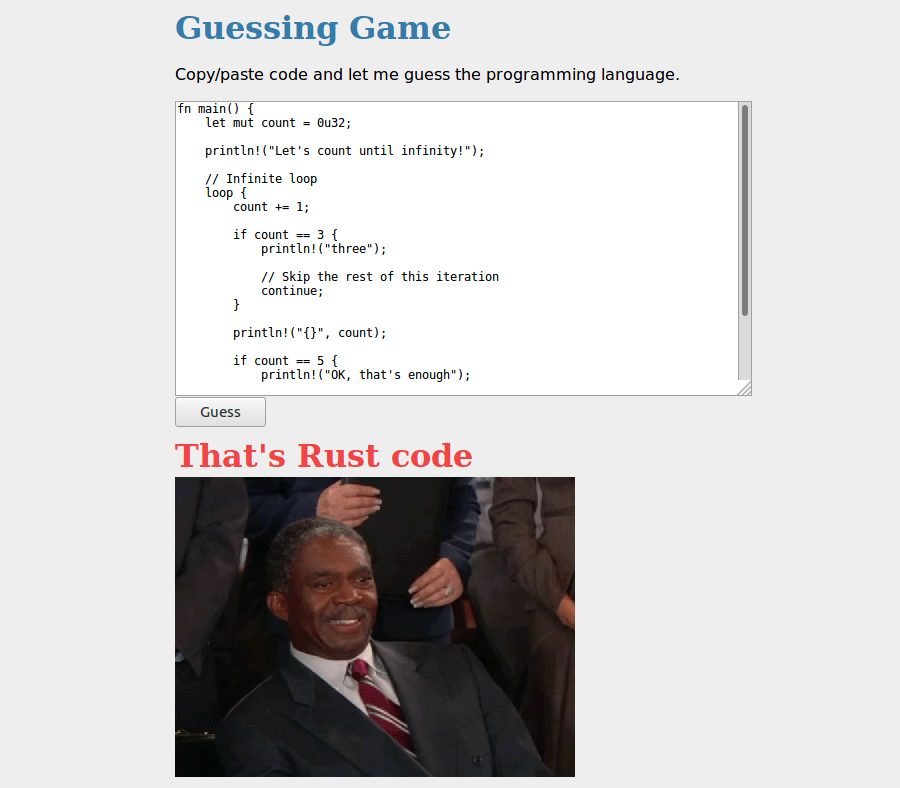

Guesslang documentation
=======================

Guesslang detects the programming language of a given source code:

.. code-block:: python

  from guesslang import Guess

  name = Guess().language_name("""
      % Quick sort

    	-module (recursion).
    	-export ([qsort/1]).

    	qsort([]) -> [];
    	qsort([Pivot|T]) ->
    	       qsort([X || X <- T, X < Pivot])
    	       ++ [Pivot] ++
    	       qsort([X || X <- T, X >= Pivot]).
  """)

  print(name)  # >>> Erlang

Guesslang supports ``20 programming languages``:

+-------------+-------------+-------------+-------------+-------------+
| C           | C#          | C++         | CSS         | Erlang      |
+-------------+-------------+-------------+-------------+-------------+
| Go          | HTML        | Java        | Javascript  | Markdown    |
+-------------+-------------+-------------+-------------+-------------+
| Objective-C | PHP         | Perl        | Python      | Ruby        |
+-------------+-------------+-------------+-------------+-------------+
| Rust        | SQL         | Scala       | Shell       | Swift       |
+-------------+-------------+-------------+-------------+-------------+

The current ``guessing accuracy is higher than 90%``.

You can contribute to Guesslang on Github
`<https://github.com/yoeo/guesslang>`_.

.. _end-description:

For implementation details, please check :doc:`how`

Apps powered by Guesslang
-------------------------

Chameledit
^^^^^^^^^^

`Chameledit <https://github.com/yoeo/chameledit>`_ is a simple web-editor
that automatically highlights your code.

.. raw:: html

  

    <video controls width="100%">
      <source src="_static/videos/chameledit.webm" type="video/webm">
      <source src="_static/videos/chameledit.mp4" type="video/mp4">
      Video not supported by your browser :-(
    </video>
  

Pasta
^^^^^

`Pasta <https://github.com/yoeo/pasta>`_ is a `Slack <https://slack.com>`_ bot
that pretty pastes source code.

.. raw:: html

  

    <video controls width="100%">
      <source src="_static/videos/pasta.webm" type="video/webm">
      <source src="_static/videos/pasta.mp4" type="video/mp4">
      Video not supported by your browser :-(
    </video>
  

GG
^^

`GG <https://github.com/yoeo/gg>`_ is a silly guessing game.

Table of Contents
=================

.. toctree::
   :maxdepth: 2

   setup
   usage
   how
   guesslang

* `Guesslang on Github <https://github.com/yoeo/guesslang>`_

Indices
=======

* :ref:`genindex`
* :ref:`modindex`
* :ref:`search`
